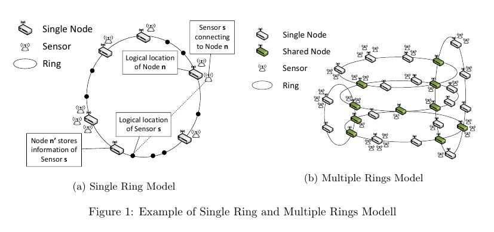
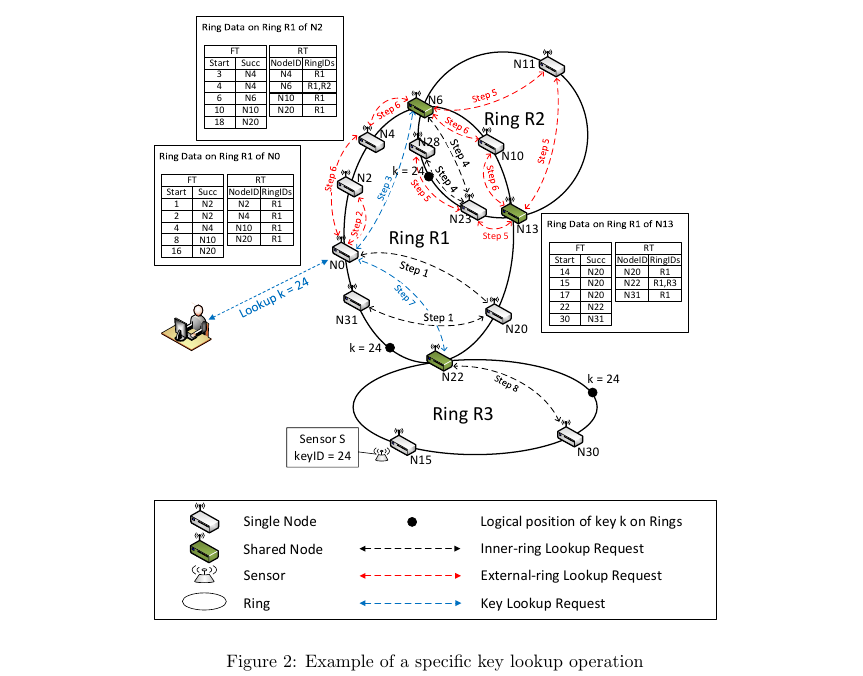

#Multi-ring DHT Chord Approach for Device Discovery in IoT Environment

##Phần 1: Giới thiệu
Trong thời điểm hiện tại, các giải pháp IoT đều cần có khả năng mở rộng hệ thống - high scalability, để đáp ứng yêu cầu xây dựng các hệ thống lớn tùy thuộc vào nhu cầu của các khách hàng.

Trong môi trường IoT, mỗi thực thể đều được định danh bằng một Identifier riêng biệt. Bên cạnh đó, tập hợp các thực thể có cùng loại, cùng tính năng, hoặc được đặt tại cùng 1 địa điểm trong hệ thống sẽ được quản lý bởi một nền tảng IoT platform chung. Để tạo ra sự thuận tiện cho việc lập trình viên phát triển các ứng dụng và dịch vụ trên nền tảng IoT, Các IoT platform sẽ cung cấp cho lập trình viên các API. Lập trình viên thông qua IoT platform API này có thể tương tác trực tiếp tới các thực thể vật lý (sensor, devices) đang được IoT platform đó quản lý, ví dụ như điều khiển các thiết bị, hay bật/tắt các sensor,vv... Tuy nhiên, do số lượng các IoT platform hiện nay càng ngày càng lớn, do đó trong cùng 1 hệ thống có thể tồn tại nhiều IoT platform khác nhau. Cho dù tất nhiều công nghệ IoT đã một số nhà sản xuất thiết bị IoT thống nhất như là các tiêu chuẩn chung cho các thiết bị IoT của họ, tuy nhiên tới thời điểm này, chúng ta vẫn chưa thể có được một tiêu chuẩn chung thống nhất cho đa số các IoT platform. Trong một hệ thống IoT lớn, sự không đồng nhất, không có các tiêu chuẩn chung giữa các IoT platform sẽ gây ra những vấn đề phức tạp khi chúng ta muốn xây dựng các giải pháp quản lý mọi thành phần trong hệ thống.
##Phần 2: Một số kịch bản về các môi trường IoT
Trong lĩnh vực IoT, các thực thể được chia làm 2 loại chính, là **sensor** và **gateway**.

Sensor là các thiết bị vật lý được sử dụng để liên tục kiểm tra và thu thập các tham số về môi trường xung quanh nó, sau đó gửi dữ liệu là tập hợp các chỉ số môi trường mà nó thu thập được tới gateway, ví dụ như sensor nhiệt độ sẽ liên tục thu thập nhiệt độ của môi trường theo thời gian rồi tổng hợp lại kết quả và gửi về cho hệ thống. Một số sensor khác sẽ có chức năng như một tác nhân của hệ thống và có thể điều khiển được từ xa, ví dụ như các sensor có thể tự động bật đèn trong phòng khi nó phát hiện ra có người xuất hiện trong phòng. 
Gateway là các thiết bị vật lý có chức năng thu nhận dữ liệu từ sensor gửi tới và điều khiển các sensor. Để thực hiện các chức năng trên, gateway phải là các thiết bị có bộ nhớ, có khả năng xử lý và có thể kết nối với môi trường mạng của hệ thống. Hiện nay, gateway có thể là các thiết bị cố định như bộ định tuyến (router) hoặc các máy tính mini,vv... cũng có thể là các thiết bị di động như điện thoại thông minh, đồng hồ thông minh vv...

Trong môi trường IoT, một trong những yếu tố không thể thiếu được, đó là mạng lưới kết nối các thiết bị IoT với nhau. Trong bài viết này, chúng ta sẽ chỉ tập trung vào việc xây dựng cơ chế để kết nối các gateway trong hệ thống với nhau và cơ chế để sử dụng các gateway tương tác với các thiết bị khác trong hệ thống.

Để cụ thể hóa vấn đề mà bài viết cần giải quyết, chúng ta sẽ lấy một ví dụ về một môi tường IoT trong thực tế, đó là việc xây dựng một hệ thống điều khiển tự động cho một tòa nhà, dùng để giám sát và điều khiển môi trường HVAC(Heating, ventilation and Air Conditioning). Kịch bản xây dựng hệ thống HVAC cho một tòa nhà của chúng ta sẽ có các đặc điểm sau:

- Số lượng các phòng trong tòa nhà là rất lớn. Trong mỗi phòng, có hàng loạt các loại sensor và thiết bị điện (cũng đóng vai trò như sensor) khác nhau. Các thiết bị này gửi dữ liệu tới các gateway trong phòng thông qua mạng internet, hoặc LAN hoặc WLAN. Một số gateway trong phòng có thể kết nối tới các gateway khác và kết nối tới phần còn lại trong hệ thống.
- Những người làm việc trong tòa nhà sẽ được nhận dạng, và tình trạng sức khỏe của họ được giám sát thông qua các thiết bị sensor trên cơ thể (wearables). Các thiết bị di động (điện thoại thông minh, máy tính bảng) sẽ đóng vai trò là các gateway, thu nhận các dữ liệu từ wearble gửi về rồi kết nối với các gateway khác trong hệ thống để gửi dữ liệu thu thập được từ các wearable sensor lên server của hệ thống, sau đó hệ thống điều khiển tự động của chúng ta sẽ phân tích và tự động điều chỉnh các thiết bị trong phòng đó để phù hợp với tình trạng của người đang làm việc trong phòng (Ví dụ như điều chỉnh nhiệt độ phòng thông qua điều hòa, lò sưởi, tăng/giảm cường độ sáng của đèn, vv...) Thêm vào đó, người dùng cũng có thể điều chỉnh các thiết bị như đèn, điều hòa, lò sưởi,vv... trong phòng thông qua điện thoại hoặc máy tính của họ. 

Trên thực tế, các thiết bị IoT trong tòa nhà có thể được cung cấp bởi nhiều nhà sản xuất khác nhau, và được quản lý bởi nhiều IoT platform khác nhau, với điều kiện tối thiểu là các thiết bị trên có thể kết nối với hệ thống thông qua hạ tầng mạng.

##Phần 5: Thiết kế cơ chế phát hiện các thực thể
Trong phần này, chúng ta sẽ mô tả cơ chế phát hiện các thực thể sử dụng Chord protocol. Chúng ta sử dụng Chord protocol làm cơ sở  để định danh các thực thể và quản lý chúng. Ngoài ra, chúng ta sẽ đề xuất xây dựng một cơ chế mới phù hợp hơn để giải quyết bài toán đã đặt ra ở phần đầu bài viết.
###5.1 Chord Protocol
Chord protocol laf một DHT protocol phổ biến được sử dụng trong mạng peer-to-peer(P2P) network. Bằng cách sử dụng consistent hashing, Chord sắp xếp các node trong hệ thống lên logic ring dựa vào identifier của node đó. Một ring có thể quản lý một lượng lớn các node (với SHA-1 160 bit là 2^160 node). Mỗi một node có 1 bảng dữ liệu bao gồm các entry chứa thông tin định tuyến để di chuyển tới các node khác trong ring, được gọi là **Finger Table - FT**. Mỗi một node có chứa 1 FT chứa O(log N) entry lưu định tuyến tới O(log N) node trong ring. Khi sử dụng Chord protocol, độ phức tạp của thao tác phân giải key là O(log N). Hệ thống tạo ra O( (log N)^2 ) thông điệp để xử lý sự kiện 1 node gia nhập hoặc rời khỏi hệ thống. 
### 5.2 Mô hình hóa hệ thống
Một hệ thống sử dụng multi ring base Chord protocol mà bài viết đề xuất bao gồm 3 thành phần, là ring, node và sensor, chúng được định nghĩa như sau:

1. Ring: Ring là một đối tượng trừu tượng, thể hiện một mạng local network. Local network này bao gồm một tập hợp các gateway, sử dụng Chord protocol để quản lý và tìm kiếm các thực thể trong network. Các gateway trong 1 ring được sắp xếp trên một Chord logic ring theo **m-bit identifier** của các gateway đó. 
2. Node: Node đại diện cho một gateway trong logic ring. Mỗi một node có một NodeID, chính là identifier của gateway. Như đã nói ở phần trên, khi một node gia nhập một logic ring, vị nó được sắp xếp trên ring phụ thuộc vào NodeID của nó. Các node có nhiệm vụ liên lạc với các node khác trên ring và lưu trữ các cặp **key-value**, các cặp **key-value**
này chứa thông tin về các thiết bị đã kết nối tới gateway đó. Có 2 loại node trong mô hình của chúng ta:
	- Singer Node: là node chỉ tham gia vào duy nhất 1 Ring trong hệ thống
	- Shared Node: là node cùng 1 lúc tham gia vào 2 hay nhiều Ring trong hệ thống.
3. Sensor - là đối tượng đại diện cho một sensor trong hệ thống thực tế. Trong hệ thống, sensor không thể gia nhập trực tiếp vào các ring như là các node(gateway). Lý do là vì sensor có những đặc điểm hạn chế về truyền thông, lưu trữ và xử lý nên không thể thực thi các nhiệm vụ của một node trong Chord protocol. Do vậy, sensor phải kết nối tới một gateway trong ring phù hợp với nó. Tuy nhiên, để quản lý các sensor, trong mô hình multi-ring mà chúng ta đề xuất, các thông tin về sensor sẽ được lưu trữ trên các node dưới dạng các cặp **key-value** theo cơ chế lưu trữ của Chord protocol.

Trong bài viết này, chúng ta tập trung vào mô hình **Multi Ring Model**, đây là mô hình tổng quát, bao gồm nhiều **Singer Ring Model** kết nối với nhau. Mô hình **Multi Ring Model** được tạo ra khi có một node trong hệ thống cùng lúc gia nhập vào 2 ring khác nhau.
 

Trên đây là một ví dụ về Single Ring Model và Multi Ring Model. Qua các ví dụ trên, ta thấy rằng single node và sensor sẽ được đặt ở trong local ring, trong khi đó share node sẽ được đặt trong nhiều ring khác nhau với cùng một identifier.

Trong thực tế, trong mô hình multi-ring của chúng ta, các thao tác quản lý và tìm kiếm trong các ring đơn lẻ được thực hiện độc lập với nhau dựa trên các nguyên lý của Chord protocol. Tuy nhiên, do hệ thống của chúng thực tế là sự kết nối các single Chord ring với nhau, do đó chúng ta cần tạo ra cho hệ thống khả năng tìm kiếm trên toàn bộ hệ thống, thông qua nhiều ring chứ không còn chỉ giới hạn trong 1 ring đơn lẻ. Để tạo ra khả năng này, trên mỗi node ngoài các thông tin định tuyến của Chord protocol như Successor, Predessor, Finger Table, chúng ta sẽ tạo ra thêm một thông tin định tuyến mới được gọi là Ring Talble (RT). Vai trò của Ring Table là cung cấp các thông tin định tuyến hỗ trợ việc chuyển tiếp yêu cầu phân giải (lookup_request) từ ring  này sang các ring khác có kết nối với ring đó. Ring Table được thiết kế tương tự như Finger Table và được phân tán trên tất cả các node trong hệ thống. Số lượng entry trong Ring Table bằng với số lượng các successor node không trùng nhau xuất hiện trong các entry của Finger Table. Mỗi một entry trong Routable có chứa 2 trường dữ liệu sau:

- NodeID: Là ID của các successor node phân biệt xuất hiện trong Finger Table
- Ring ID: Là ID của các ring mà các successor node trên cùng tham gia vào trong thời điểm hiện tại.

Dưới đây là một ví dụ về các thông tin sẽ được lưu trên một node trong hệ thống Multi-ring của chúng ta:


Lý do để chúng ta tạo ra một bảng RingTable thay vì thêm trường RingIDs vào các entry trong Finger Table, đó là vì trong Finger Table có thể có rất nhiều entry có cùng một Successor Node. Nếu chúng ta sử dụng cách thêm các RingID vào các entry trong Finger Table, thì sẽ có nhiều cặp giá trị NodeID-RingID sẽ bị trùng lặp trong bảng Finger Table. Khi đó, việc kiểm tra và update các giá trị Ring Table trùng lặp khi hệ thống thay đổi là lãng phí và không hiệu quả.


Cơ chế để định danh và phát hiện các chức năng của các thành phần này sẽ được trình bày trong phần tiếp theo.

###5.3 Discovery Functionalities
Trong phần này, chúng ta sẽ mô tả làm thế nào để định danh cho các thực thể trong hệ thống, thao tác chèn/xóa một cặp dữ liệu key-value vào hệ thống, thao tác **key look-up** - tìm kiếm successor node chứa cặp key-value tương ứng với một key - identifier k cho trước và thao tác xử lý node join/leave.

####5.3.1 Định danh cho các thực thể trong hệ thống

Trong thực tế, các định danh nguyên bản - **origin device identification**  của các thiết bị thường không đồng nhất về định dạng với nhau, do đó chúng ta cần chuyển đổi các giá trị định danh nguyên bản của các thiết bị sang một định dạng đồng nhất, để các identifier của các thiết bị có thể được sử dụng trong Chord protocol của hệ thống. Nói cách khác, các **origin device ID** sẽ được chuyển sang định danh **m-bit identifier** bằng cách sử dụng hàm băm cố định - **consistent hashing**. Chúng ta sẽ sử dụng thuật toán SHA-1 để làm consistent hashing cho hệ thống.

Theo đó, m-bit identifier của các **sensor device** sẽ được tạo ra theo công thức  **key = hash(SensorID)**, còn m-bit identifier của các node - gateway device sẽ được tạo ra theo công thức  **key = hash(NodeID)**. Các m-bit identifier sau khi được tạo ra sẽ là đinh danh chính thức của các thiết bị này trên hệ thống.

Thêm vào đó, khi một node trong hệ thống có thể  cùng 1 lúc gia nhập 2 hay nhiều ring, nên chúng ta cần phải phân biệt các logic ring trong hệ thống với nhau. Như đã trình bày ở phần đầu, ring là 1 đối tượng trừu tượng, do đó chúng không có định danh nguyên bản như các node và sensor. Do đó, chúng ta sẽ tạo ra một thuộc tính mới cho đối tượng **ring** là **RingID** để định danh cho chúng. Theo Chord DHT protocol, thì ring được tạo ra khi một node đầu tiên gia nhập vào ring.  Do đó, node đầu tiên gia nhập vào ring sẽ được sử dụng để tạo ra **RingID** theo công thức sau: **RingID = hash(NodeID| timestamp)**. Lý do để ta sử dụng cả NodeID và timestamp trong công thức tạo ra RingID, đó là để tránh xung đột trong hệ thống khi có 2 ring được tạo ra ở cùng 1 khoảng thời gian, hoặc 1 node lần lượt tạo ra liên tiếp 2 ring (tất nhiên 1 node không thể tạo ra 2 ring cùng 1 lúc !). Với công thức trên, mỗi *ring* trên hệ thống sẽ có một **RingID** riêng biệt và duy nhất - **uniqueID**, giúp chúng ta có thể định danh ring đó trên hệ thống.

###5.3.2 Các thao tác xử lý sự kiện 1 node gia nhập/rời khỏi 1 ring trên hệ thống

Thao tác xử lý sự kiện 1 node gia nhập hệ thống trong cơ chế mới được xây dựng dựa trên Chord node join operation protocol. Tuy nhiên, điểm mới trong mô hình của chúng ta, đó là thao tác ** node join** của chúng ta có thể rơi vào 1 trong 2 trường hợp sau:
- Node *n* được gia nhập vào một ring **r_join**  chưa nằm trong bất kỳ 1 ring nào trong hệ thống
- Node *n* được gia nhập vào một ring **r_join** trước đó đã nằm ở một số ring khác **r_ext**  trong hệ thống.

Trong trường hợp 1, phương thức xử lý tương tự như phương thức trong Chord protocol, phương thức này bao gồm 3 bước:

1. Xác định identifier của node *n* và lưu trữ trong node *n* một structure **single-ring-data-structure ** bao gồm các thuộc tính sau: 
	-  ringID
	- predeccessor
	- successor
	- finger-table
	- route table 
2. Cập nhật finger-table cho các node đã có trong ring trước node n
3. Di chuyển các thông tin - các cặp **key-value** trong node **n's successor** mà không đúng vị trí trong trạng thái mới của hệ thống sang node *n*

Ý nghĩa của việc sử dụng **single-ring-data-structure** sẽ được làm rõ khi ta mô tả phương thức xử lý cho trường hợp thứ 2, còn ý nghĩa của **route-table** sẽ được trình bày ở phần 5.3.4

Đối với trường hợp thứ 2, vì *n* trước đó đã nằm trong các ring khác của hệ thống, do đó trong node n hiện tại đã tồn tại các structure **single-ring-data-structure**  chứa thông tin về node *n* trong các ring mà node *n* đã tham gia trước đó, nên chúng ta sẽ tạo ra một  **single-ring-data-structure** mới cho các thông tin về ring  **r_join** mà nó sắp gia nhập. Tất cả các struct chứa thông tin về các ring mà *n* tham gia sẽ nằm trong *n* dưới dạng 1 danh sách có tên là  **multiple-ring-data-structure**.

Trong trường hợp này, thao tác xử lý sự kiện **node join** bao gồm 4 bước sau:

1. Khởi tạo một  **single-ring-data-structure** tương ứng với ring **r_join** mà *n* sắp gia nhập và thêm nó vào danh sách  **multiple-ring-data-structure** trên n.
2. Cập nhật finger-table và route table cho các node đã có trong ring **r_join**.
3. Cập nhật route table cho các node  nằm trong các ring mà *n* đã gia nhập trước đó.
4. Di chuyển các thông tin - các cặp **key-value** trong node **n's successor** trong ring mới **r_join** mà không đúng vị trí trong trạng thái mới của hệ thống sang node *n*

Ý nghĩa của việc cập nhật các route-table ở bước 2 và bước 3 liên quan tới việc thông báo rằng n là **share node** cho các node còn lại trong các ring
Thao tác xử lý sự kiện 1 node rời khỏi hệ thống được thực hiện tương tự như thao tác gia nhập. Khi 1 node n muốn rời khỏi ring, nó sẽ thông báo cho các successor node của nó để di chuyển các cặp **key-value**không nằm đúng vị trí trong trạng thái mới sang vị trí đúng của các cặp **key-value** đó - **n's successor node**, đồng thời thực hiện việc cập nhật lại các finger-table và route-table trên các node trên các ring mà *n* gia nhập để đảm bảo tính ổn định cho các ring sau khi *n* rời khỏi ring.

Theo lý thuyết, thì trong trường hợp 1 số lượng node cần cập nhật finger-table là ```O(log N)``` node và số lượng node sẽ được liên lạc là ```O( (log N)^2 )``` với N là số lượng node trên ring. trong trường hợp 2 số lượng node cần cập nhật finger-table và route table là tổng của các ```O( log N_i )``` với N_i là số lượng node của ring *i*. Và số lượng node cần liên lạc là tổng của ```O( (log N_i)^2 )``` 

###5.3.3 Key Insertion/Removal Operation
Thao tác thêm xóa cặp key-value vào node là thao tác được thực thi khi một sensor kết nối / ngắt kết nối vào một node trong hệ thống.

Khi một sensor *s* bắt đầu kết nối tới node *n*, chúng ta cần thực hiện thao tác thêm cặp key-value đại diện cho sensor *s* vào hệ thống theo 3 bước sau:
1. Node *n* tạo ra 1 key *s_id* - m-bit identifier đại diện cho sensor *s*. 
2. Node *n* tìm succesosr node của *s_id* trên hệ thống, node này được gọi là node *n'*. Sau đó, node *n* sẽ gửi 1 thông điệp tới node *n'*, yêu cầu *n'* lưu trữ cặp *key-value* với key là sensor m-bit identifier *s_id*, và value là thông tin của sensor.
3. Node *n'* xử lý thông điệp do node *n* gửi tới bằng cách lưu trữ cặp *key-value* mà node *n* gửi tới vào bộ nhớ của nó.

Trong mô hình của chúng ta, khi một sensor kết nối tới 1 node, sẽ có 2 trường hợp xảy ra. Nếu node *n* mà sensor kết nối tới là một single node, thì chỉ có succesor node lưu trữ cặp key-value do node *n* tạo ra. Nếu node *n* là 1 shared node kết nối tới *x* ring, thì chúng ta sẽ có *x* successor node, mỗi successor node lưu trữ 1 cặp key-value do node *n* tạo ra.
Theo các định lý trong Chord protocol, thì trong thao tác **Key Insertion/Removal Operation**, hệ thống sẽ cần kết nối tới O(log N) nodes trong trường hợp node kết nối với sensor là single node, hệ thống cần kết nối tới  O( sum(log N_i)) node trong trường hợp node kết nối với sensor là shared node.

###5.3.4 Key Looking Up Operation
*Key lookup operation* - Thao tác tìm kiếm successor node của 1 key *m* cho trước là chức năng có vai trò quan trọng nhất trong mô hình multi-ring mà bài viết này đề xuất. Hệ thống thực hiện thao tác này khi một node *n* trong một ring nào đó của hệ thống nhận được yêu cầu phân giải m-bit identifier key *k*.


Trên hệ thống Chord multi ring, **key lookup** được chia ra làm 2 loại sau:

- Inner-ring lookup: Là thao tác tìm successor node của 1 identifier *k* bên trong một ring và kiểm tra xem successor đó có chứa cặp **key-value** tương ứng với **k** hay không.
- External-ring lookup tìm các shared nodes nằm trong cùng ring với node đang xét để thực hiện thao tác chuyển truy vấn tới thực hiện tại 1 ring khác trên hệ thống, trong trường hợp ring hiện tại chúng ta đang xét có **k-predecessor node** không có chưa cặp key-value tương ứng với key *k*.

Hai loại  **key lookup** trên được sử dụng để tìm kiếm trên toàn bộ các ring của hệ thống cho đến khi tìm thấy ring chứa **k-predecessor node** chứa cặp key-value tương ứng với **k**.


Algorithm 1: External-ring lookup algorithm
```python

def n.externalringLookup(passed_rings_list, curent_ringID):
	shared_nodes = [ ]
	ring_data = n.get_Ring_Data(curent_ringID)
	ring_table = ring_data.ring_table
	
	#Step1: Find shared nodes in route table of current ring data
 	for row in ring_table:
 		if row.ringIDs has ringIDs not in passed_rings_list:
			Append row.nodeID and new found ringIDs into shared_nodes
	
	if shared_nodes!= [ ]:
		#if new ringID found, return
		response.cache_node = ring_data.successor;
		response.shared_nodes = shared_nodes;
		return response;
	else:
		# if new ringID not found, conduct Step 2
		# Step 2: Foward to its successor on current ring
		succ = ring_data.successor;
		response = succ.externalringLookup(passed_rings_list, curent_ringID);
		return response;
```
Vì các single ring trong hệ thống đều sử dụng Chord protocol, nên thao tác **inner-ring lookup** sẽ sử dụng cơ chế của Chord là sử dụng successor, predecessor và Finger Table để tìm ra successor node trên ring đối với identifier *k*. Trong khi đó External-ring lookup sử dụng algorithm 1 phía trên để tìm ra các ring kết nối với ring hiện tại đang xét mà chưa bị khám phá. Algorithm này hoạt động như sau:

- Đầu tiên, node n kiểm tra xem trong bảng Ring table của nó có node nào là shared node hay không ?
- Nếu trong Ring table có chứa node là shared node, nó kiểm tra xem các ring trong shared node đó đã được khám phá hay chưa (ringIDs **not in** passed rings list )
- Trong trường hợp không có ring nào trong các shared node của ring table là chưa được khám phá, **external_ring_lookup** được chuyển tiếp sang successor node và tại successor node, thao tác **external_ring_lookup** được thực hiện lại từ đầu.
	
Thao tác **external_ring_lookup** được thực hiện lặp lại trên các node trong ring, cho đến khi thuật toán tìm được một shared node kết nối tới 1 ring chưa được khám phá, hoặc cho đến khi tất cả các node trong ring được duyệt qua. Trong thuật toán 1, để tránh cho thao tác  **inner-ring lookup** bị thực hiện lại trên các ring đã được khám phá, 2 tham số **passed_ring_list** và **cache_node** được thiết kế để đánh dấu các ring đã được thuật toán khám phá và successor của node hiện tại. Tham số **passed_ring_list** đảm bảo rằng một ring trong hệ thống không bị khám phá 2 lần, còn **cache_node** được sử dụng để  ???

Một ví dụ cụ thể về key lookup được trình bày ở hình vẽ sau đây:
 

Trong ví dụ này, *m* được chọn = 5, chúng ta sẽ có không gian địa chỉ key là 2^5 địa chỉ. Trong ví dụ này, node đầu tiên trong hệ thống nhận được yêu cầu phân giải key - **key look up** là  node **N0**, với key cần phân giải có là key *k* = 24. Như hình vẽ ta thấy, Sensor S có key trùn khớp với key mà yêu cầu phân giải gửi lên hệ thống đang được kết nối tới Node N15 trên ring R3, tuy nhiên cặp **key-value** chứa thông tin của sensor này lại được lưu trữ ở node **N30** trên ring R3. Quá trình phân giải key được diễn ra như sau.

Ở bước 1, **inner ring lookup** được thực hiện trên Ring R1 theo cơ chế của Chord protocol. Chúng ta tìm được N31 là successor node của **k = 24** trên ring R1, tuy nhiên kiểm tra, ta không thấy N31 chứa thông tin về key **k = 24**. Do vậy chúng ta chuyển sang thực hiện thao tác **external_ring_lookup** trên node N0. Khi truy vấn Ring Table trên N0, chúng ta không tìm được shared node nào, do vậy N0 gửi yêu cầu tới successor node của nó là N2 yêu cầu N2 thực hiện **external_ring_lookup**. N2 thực hiện thao tác này và tìm ra N6 là shared node kết nối tới 1 ring khác chưa được khám phá, đồng thời Cache_node N4 được gửi về N0. Lúc này N0 sẽ chuyển tiếp yêu cầu phân giải key **k=24** sang cho N6. N6 sẽ thực hiện  **inner ring lookup**  trên ring R2, do R1 đã được khám phá. Lúc này chúng ta sẽ tìm ra node N28 là successor của k = 24 trên R2, nhưng tương tự lần trước, N28 không chứa thông tin về key k =24. Lúc này  **external_ring_lookup** sẽ được thực hiện trên các node của Ring R2
// Chờ comfirm lại

Theo lý thuyết, thao tác key lookup sẽ trên 1 ring có *N* node sẽ có độ phức tạp là *O(log N)*. Khi node nhận được yêu cầu phân giải key nằm cùng một ring với node đang chứa thông tin về key đó, thì thao tác lookup chỉ cần thực hiện một **inner ring lookup** với độ phức tạp là *O(log N)*. Trong trường hợp node đang chứa thông tin về key không nằm cùng ring với node nhận yêu cầu phân giải, thì chúng ta sẽ có *O(N)* thông điệp được gửi đi để tìm ra các ring kết nối với ring hiện tại chưa được khám phá.  Giả sử hệ thống của chúng ta đang có M ring, thì chúng ta sẽ cần gửi  *O(M log N )*  thông điệp để thực hiện các thao tác **inner ring lookup**, và *O((M − 1)N )* thông điệp để thực hiện **external_ring_lookup**

