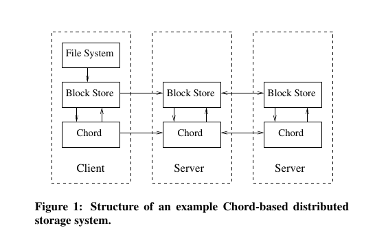
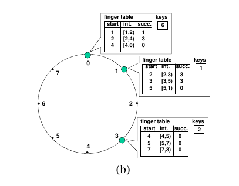
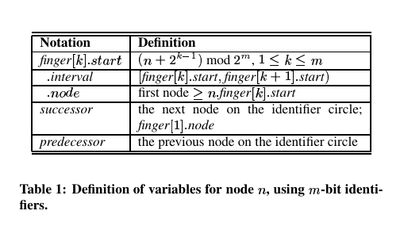

#Chord: A Scalable Peer-to-peer Lookup Service for Internet Applications

Author : Ion Stoica, Robert Morris, David Karger, M. Frans Kaashoek, Hari Balakrishnan
MIT Laboratory for Computer Science
chord@lcs.mit.edu
http://pdos.lcs.mit.edu/chord/

##Abstract
Một vấn đề cơ bản cần giải quyết trong các hệ thống Peer - to - Peer, là  cần định vị dữ liệu được lưu trên hệ thống ở vị trí nào. Bài báo này trình bày về Chord, một distributed protocol giúp giải quyết bài toán định vị vị trí của dữ liệu trên hệ phân tán. Nhiệm vụ cơ bản của Chord, đó là cho một cặp **key - data**, Chord cần tìm ra node nào trên hệ thống sẽ lưu trữ cặp **key-data** đó. Bên cạnh đó, Chord protocol có các giải pháp cho phép xử lý sự kiện một node gia nhập cũng như rút khỏi hệ thống một cách hiệu quả.
##Introduction
Trong peer - to - peer system, hệ thống không phân chia theo thứ bậc, không có trung tâm điều khiển, mọi node trong hệ thống đều có vai trò và vị trí như nhau. Một trong những nhiệm vụ chính trong peer-to-peer system là xác định vị trí của dữ liệu. Bài báo này trình bày một scalable protocol, protocol này giải quyết bài toán xác định vị trí dữ liệu trên một dynamic peer-to-peer system - loại peer-to-peer system thường xuyên có sự biến động về tập hợp các node, thường xuyên xảy ra các sự kiện node mới gia nhập và node cũ rời khỏi hệ thống.

Chord protocol giải quyết bài toán sau: - Cho một key **m**, Chord sẽ gán key **m** đó với một node **n** trong hệ thống. Sau đó, node **n** sẽ lưu trữ một cặp **key-value**, trong **key** là m, và **value** là dữ liệu gắn với **key m**. Để tìm ra node sẽ được gán key **m**, Chord sử dụng một hàm băm cố định - consistent hashing. Với việc sử dụng consistent hashing, Chord tạo ra tính chất cân bằng tải (balance load) trên hệ thống, có nghĩa là các node trên hệ thống sẽ lưu trữ số lượng key gần như nhau, đồng thời, khi có node gia nhập hoặc rời khỏi  hệ thống, thì số lượng key phải điều chỉnh vị trí là nhỏ nhất.

Một vấn đề khác trong hệ thống sử dụng Chord protocol, đó là điều hướng yêu cầu phân giải key. Để điều hướng các yêu cầu, mỗi node trong chord sẽ có một bảng định tuyến (routing table). Trong trạng thái hệ thống ổn định, mỗi một node trong hệ thống N-node Chord có một bảng định tuyến có O(log N) dòng, thao tác phân giải  có độ phức tạp  O(log N), và khi có node gia nhập hoặc rời đi trong hê thống, thì các bảng định tuyến trong các node phải điều chỉnh, sự điều chỉnh các bảng định tuyến tạo ra O((log N) ^2) thông điệp trên hệ thống.

Các phần quan trọng trong bài báo:

- Section 3 giới thiệu về System model là tiền đề thúc đẩy sự xuất hiện của Chord Protocol 
- Section 4 giới thiệu Chord protocol và các tính chất của protocol này
- Section 5 giới thiệu các giải pháp để xử lý các sự kiện node gia nhập và rời đi trong hệ thống sử dụng Chord protocol.

##System Model

Chord Protocol giúp giải quyết các vấn đề sau trong peer-to-peer system:

- Load balance: Chord là một trong các implementation của DHTs, do đó protocol này hoạt động như một hàm băm phân tán. Hàm băm này phân bố đều số lượng key lên tất cả các node trong hệ thống, vì vậy Chord giúp cho hệ thống có được tính chất cân băng tải một cách tự nhiên nhờ nguyên tắc hoạt động của protocol này.
- Decentralization: Chord là protocol thuần phân tán, điều này có nghĩa là trong Chord, các node có vai trò tương đương nhau. 
- Scalability: Chi phí cho các thao tác trong Chord protocol là logarit của số lượng node, do vậy khi sử dụng Chord trong các hệ thống lớn thì chi phí để thực thi các thao tác trong Chord vẫn nằm ở mức nhỏ, do vậy chúng ta không cần can thiệp nhiều vào hệ thống khi thực hiện scale system.
- Availability: Chord tự động điều chỉnh các thông tin khi một node mới gia nhập, cũng như khi một node bị lỗi hoặc có một node rời khỏi hệ thống. Do vậy Chord đảm bảo luôn xác định được node chịu trách nhiệm phân giải một key bất kỳ, cho dù trạng thái hệ thống liên tục thay đổi. 
- Flexible naming: Chord sử dụng Flat Naming, do đó các key sử dụng trong Chord không cần phải có cấu trúc.


Một số ví dụ thực tế mà Chord sẽ là một giải pháp tốt:

- Cooperative Mirroring
- Time-Shared Storage: Là hệ thống lưu trữ dữ liệu cho các node có kết nối không ổn định.
Chúng ta muốn một vài dữ liệu luôn luôn có mặt trên hệ thống, tuy nhiên các node trên hệ thống chỉ có mặt trên hệ thống vào một số khoảng thời gian, không có node nào liên tục có mặt trên hệ thống. Lúc này, giải pháp là, khi một node gia nhập vào hệ thống, nó sẽ nhận lưu trữ một phần dữ liệu từ node khác chuyển qua. Và khi nó rời khỏi hệ thống, nó sẽ chuyển dữ liệu mà nó đang lưu trữ sang một node khác trong hệ thống. Sử dụng Chord giúp giải quyết được bài toán thay đổi địa điểm lưu trữ trên hệ thống này, lúc này identifier của dữ liệu được lưu trữ sẽ đóng vai trò là key, và sử dụng key này ta sẽ luôn luôn biết được node nào đang lưu trữ dữ liệu của chúng ta vào bất kỳ thời gian nào.
- Distributed Indexes
- Large-Scale Combinatorial Search

Sơ đồ dưới đây thể hiện kiến trúc three-layered cho một Cooperative Mirroring System. 

 
Tầng cao nhất cung cấp giao diện sử dụng cho người dùng, giống như là một phần mềm quản lý file, cung cấp tương tác cho người dùng và xác thực - File System Layer. File System Layer này sẽ thể hiện các file và thư mục cho người dùng. Và khi người dùng muốn xem nội dung file hoặc thư mục nào đó trên hệ thống, nó sẽ truyền yêu cầu xuống tầng  “block storage” layer, với các tham số truyền vào yêu cầu là key của file - thư mục mà người dùng muốn xem nội dung ( Việc ánh xạ giữa key của file -thư mục với tên mà file - thư mục hiển thi là nhiệm vụ của File System Layer).

Block Storage Layer có nhiệm vụ là lưu trữ các block chứa nội dung của các file và thư mục.
Khi nó nhận được yêu cầu đọc nội dung của block tương ứng với key được truyền tới, nó sẽ sử dụng Chord để xác định xem node nào trong hệ thống đang lưu trữ block tương ứng với key này, sau đó nó sẽ gọi tới node này và yêu cầu node này cung cấp nội dung chứa trong block đó - nội dung này cũng chính là nội dung của file hoặc thư mục mà File System Layer yêu cầu được cung cấp.

##The Base Chord Protocol
Chord Protocol xác định phương thức giải quyết các vấn đề sau:
- Với một key **k**, tìm ra node lưu trữ key **k** đó
- Phương thức một node gia nhập vào hệ thống
- Phương thức xử lý để phục hồi hệ thống khi có một node trong hệ thống bị lỗi.
- Phương thức xử lý sự kiện một node rời khỏi hệ thống

Chương này trình bày version đơn giản của Chord Protocol. Version được trình bày trong chương này sẽ không trình bày phương thức xử lý khi có nhiều node gia nhập và gặp lỗi trên hệ thống đồng thời cùng một lúc (cocurrent joins or failures. Vấn đề này sẽ được trình bày trong section 5 
###Overview

Chord Protocol đảm bảo các tính chất sau của hệ thống sẽ được đảm bảo với xác suất cao nhất:
- Trong một thời điểm bất kỳ, các node trong hệ thống sẽ lưu trữ số lượng **key-value** gần như tương đương nhau
- Khi một node thứ n nào đó trong hệ thống gia nhập hoặc rời đi, số lượng các cặp **key-value** cần di chuyển vị trí là O(1/N)

Chord protocol không yêu cầu điều kiện một node trong hệ thống phải biết được tất cả các node còn lại. Mỗi một node chỉ cần duy trì một lượng nhỏ thông tin định tuyến tới các node khác trong hệ thống, thông tin định tuyến này được sử dụng để phục vụ thao tác tìm kiếm của Chord. Thông tin định tuyến là một bảng định tuyến có kích thước O (log N) trường, và thao tác tìm kiếm của Chord cần O(log N) thông điệp.

Chord cần phải cập nhật bảng định tuyến khi có một node gia nhập hoặc rời khỏi hệ thống. Sự kiện 1 node gia nhập hoặc rời khỏi hệ thống tạo ra O(log^2 N) thông điệp trên hệ thống. 
###Consistent Hashing
Hàm băm cố định được sử dụng trong Chord sẽ gán cho các node và các cặp **key-value** sử dụng trong hệ thống một **m-bit identifier** bằng cách sử dụng các hàm băm như SHA-1. m-bit identifier của một node được tạo ra bằng cách hashing địa chỉ IP của node đó, trong khi đó m-bit identifier của cặp **key-value** được tạo ra bằng cách hashing **key** ?( Chưa chắc chắn về điều này). Điều quan trọng khi sử dụng Chord protocol, đó là m phải đủ lớn để không xảy ra trường hợp có 2 node hoặc key sau khi hashing có cùng chung một m-bit identifier.

Sau khi kết thúc quá trình hashing, các node được xếp lên một ring logic. Một key k được gán vào node có m-bit identifier bằng k, hoặc là node đầu tiên nằm phía sau giá trị **k** trên ring logic, node này được gọi là **succ(k)**.

Consitent hashing được thiết kế để cho phép các node gia nhập hoặc rời khỏi hệ thống mà không tạo ra quá nhiều xáo trộn và thay đổi. Để duy trì tính chất này, khi một node *n* ra nhập hệ thống, nó sẽ trao đổi và điều chỉnh các cặp **key-value** với node succ(n). Khi node *n* rời khỏi hệ thống, nó sẽ chuyển toàn bộ các cặp **key-value** mà nó đang lưu trữ sang node succ(n).
 
 
 Các kết quả dưới đây đã được chứng minh ở bài báo giới thiệu consistent hashing:
 **Định lý 1**
*
Với một hệ thống có **N** node và **K** cặp key-value, thì hệ thống sẽ có các tính chất sau với xác suất cao (high-probability) :
 - Mỗi một node trong hệ thống lưu trữ tối đa (1+*e*)K/N cặp key-value
 - Khi node (n+1) gia nhập hoặc rời khỏi hệ thống, hệ thống cần di chuyển  O(K/N) cặp (key-value) giữa các node trong hệ thống.
 *
 Định lý 1 chỉ ra rằng cận trên của *e* là O(log N).  Chúng ta có thể giảm *e* tới hằng số, nếu như mỗi một node thật trên hệ thống triển khai O(log N) node ảo - (virtual node) cùng với O(log N) identifier ảo tương ứng. 
 
 Chúng ta sẽ chọn hàm hash là hàm standard SHA-1. 

###Scalable Key Location
Một trong những thao tác chính mà Chord Protocol phục vụ, đó là thao tác tìm kiếm. Thao tác tìm kiếm trong Chord được bắt đầu, khi một node trong hệ thống nhận được yêu cầu phân giải một identifier *k* từ đối tượng *x* trong hệ thống. Lúc này thuật toán định tuyến của Chord sẽ điều hướng yêu cầu qua một số node trong hệ thống cho đến khi yêu cầu phân giải tới node succ(k). Lúc này node succ(k) sẽ phân giải identifier *k* và trả kết quả phân giải về đối tượng *x*. 

Thuật toán điều hướng yêu cầu cơ bản của Chord được thực hiện nhờ vào tính chất : mỗi node i trong hệ thống đều lưu trữ vị trí của node tiếp theo nó - successor của nó, node succ(i). Do đó, nguyên tắc đơn giản của thuật toán điều hướng cơ bản, là nó sẽ điều hướng yêu cầu sang node succ(i), nếu như nó không phải là node phân giải được identifier **k** (không phải succ(k)). Tuy nhiên thuật toán cơ bản này không hiệu quả, vì chi phí để thực hiện yêu cầu phân giải lúc này là O(N), tức là yêu cầu truy vấn trong trường hợp xấu nhất sẽ đi qua N node để tìm ra node phân giải cho identifier **k**.

Để quá trình phân giải identifier trở nên nhanh chóng, Chord duy trì các thông tin điều hướng trên các node, như ta đã nói ở phần trước, là routing table, routing table chứa O(log N) trường. Thông tin trong routing table không cần thiết phải luôn luôn chính xác, tuy nhiên thông tin về successor của một node bất kỳ thì luôn luôn cần chính xác.

Ta biết rằng m là số lượng bit của key/node identifier. Routing table của mỗi node trong hệ thống có kích thước là m entry (m dòng). entry thứ *i* (1<=i<=m)trong routing table sẽ lưu trữ thông tin của node có identifier là *s*, với ```s = succ([n+2^(i-1)] mod 2^m). ```. Node *s* được gọi  là finger thứ *i* của node n, được ký hiệu *n. finger[i].node. Thông tin của node *s* lưu trên entry bao gồm: identifier của node (s), đia chỉ IP + port của node s. Chúng ta có thể thấy rằng, trên bảng định tuyến thì finger đầu tiên **n.finger[1]** cũng chính là **succ(n)**, và chúng ta sẽ sử dụng thuật ngữ **succ(n**) nhiều hơn là **n.finger[1]**

Xét một ví dụ sau: ta có sơ đồ logic ring của một hệ thống với m =3 như sau:

 

Theo sơ đồ trên, trên hệ thống đang có 3 node 0,1,3. Trên node 1, bản finger table có 3 entry, 3 entry này chỉ ra các successor node của 3 identifier là 2, 3 và 5. Nhìn vào sơ đồ, ta thấy được, succ(2) =3, succ(3)=3, succ(5)=0. Routing table của node 3 có 3 interval là [4,5), [5,7) và [7,3)

Nhờ sử dụng phương thức định tuyến này, Chord protocol có 2 thuộc tính quan trọng: Thứ nhất, trên mỗi node chỉ lưu trữ một bảng định tuyến chứa thông tin về một số lượng nhỏ (m) node trên hệ thống. Thứ 2, bảng định tuyến không có đủ thông tin để chỉ ra successor của *identifier k* là node nào. Ví dụ, theo sơ đồ phía trên, *node 3* không xác định trực tiếp được successor của *identifier 1*

Với các tính chất trên, việc tìm kiếm succ(k) từ node n sẽ sử dụng phuong pháp sau: Nếu node n biết được nó không phải succ(k), nó sẽ bắt đầu tìm kiếm node có identifier gần *k* hơn so với nó, node gần với k hơn sẽ biết nhiều về khu vực ring logic chứa k trong đó. Do vậy, n sẽ tìm trên bảng định tuyến node *j* gần *k* nhất và hỏi *j* về node nằm gần *k* nhất là node nào. Quá trình trên được lặp lại cho đến khi chúng ta tìm được *precedessor(k)* - là node phía sau *identifier k* trên logic ring, *precedessor(k)*!=*k*. Ví dụ precedessor(6) = 3, precedessor(3) = 1, precedessor(0) = 3.

Chúng ta cùng xem implement của thuật toán tìm kiếm succ(k) trên hệ thống. Một số ký hiệu được sử dụng trong thuật toán được mô tả ở bảng sau:
 
Thuật toán giải quyết quá trình tìm kiếm succ(k):

```python
#ask n to find id's successor
n.find_successor(id):
	x = n.find_predecessor(id)
	return x.succesosr

#function which search predecessor of identifier id
n.find_predecessor(id):
	x=n
	while( id not_belong (x, x.successor]  ):
		 x = x.closest_preceding_finger(id)
		 return x 
#find closest node to id in finger table of a node
n.closest_preceding_finger(id):
	for i = m downto 1:
		if( finger[i].node belong (n, id) ):
			return finger[i].node
	return n
```

Giải thích thuật toán:
Thuật toán đi tìm ra successor của id bằng cách tìm ra predecessor của id, sau đó tìm node x =  successor( predecessor(id)). x cũng chính là successor(id).

để tìm ra predecessor(id), thuật toán sử dụng hàm n.find_predecessor(id). Nhiệm vụ của hàm này là: Đầu tiên kiểm tra xem n có phải là  predecessor của id hay không ? Nếu không phải,  nó gọi hàm *closest_preceding_finger(id)*. Hàm này sẽ làm nhiệm vụ tìm ra xem trong routing table của n node x nào thỏa mãn 2 điều kiện:
- Đứng sau *id* trên logic ring so với *n* theo chiều kim đồng hồ. (#)
- Gần nhất với id so với các entry khác trên routing table. 

Ở đây, xuất hiện 1 câu hỏi, tại sao trong hàm *closest_preceding_finger(id)*, ta lại xét điều kiện 
*finger[i].node belong (n, id)* ?
Lý do là điều kiện này tương đương với điều kiện *finger[i].node* đứng sau *id* so với *n*, vì nếu 
 *x* = *finger[i].node* đứng sau *id* so với *n* thì một vòng xoay thứ tự tương đối giữa 3 identifier này được vẽ ra : x->id->n->x->id->n->... Rõ ràng ta thấy rằng, x nằm trong *khoảng logic (n, id)*
Vậy tại sao lại là *khoảng logic (n,id)* mà không có n và id ?

Lý do là theo tính chất của routing table, không có bất cứ finger[i].node nào có giá trị = n. Thứ 2, là id có trong khoảng chỉ có ý nghĩa khi ta xét tới trường hợp x=id. Nhưng khi x=id, thì x lại chính là successor của id, mà ta đang tìm kiếm predecessor của id, do vậy không thể đưa giá trị id vào khoảng.

Câu hỏi thứ 2, là tại sao ta lại xét vòng lặp trong hàm *closest_preceding_finger(id)* từ m về 1 mà không xét từ 1 tới m như bình thường ?

Nếu xét từ m về 1, thì nếu finger[m].node thỏa mãn điều kiện (#) thì chăc chắn finger[m].node sẽ là node có khoảng cách nhỏ nhất, vì trên ring logic, thứ tự sắp xếp của các node trong routing table như sau:
```
 n-> finger[1]-> finger[2]-> finger[3]-> ... -> finger[m]-> n-> finger[1]...
``` 
 Nếu finger[m] thỏa mãn (#) thì id nằm giữa finger[m] và n, và nhìn vào thứ tự sắp xếp các node ở trên chúng ta chăc chắn rằng m thỏa mãn điều kiện node gần nhất. Trong trường hợp m không thỏa mãn điều kiện #, chúng ta tiếp tục xét tới m-1, và cũng với lý do tương tự như trên, nếu m-1 thỏa mãn #, thì chăc chắn m-1 thỏa mãn điều kiện node gần nhất ... các node còn lại trong routing table cũng tương tự như vậy khi vòng for downto được thực hiện.
 
 Sau khi giải thích rõ ràng nguyên tắc hoạt động của hàm  *closest_preceding_finger(id)*, chúng ta xét tiếp phần còn lại của thuật toán. 
 
 Lúc này, sau khi tìm được node gần nhất với id trên routing table, thuật toán kiểm tra xem nó có phải là predecessor của id hay không ? Nếu nó là predecessor của id, thuật toán hoàn thành. Nếu không phải, thì thuật toán gọi đệ quy tiếp tục (chính là vòng lặp ```while( id not_belong (x, x.successor]  )```, n gửi hàm remote RPC tới node này, yêu cầu node này **tìm node gần nhất với id trên bảng định tuyến của nó,** ,vv..., và khi chu trình tìm node gần nhất này lặp lại, thì chúng ta càng ngày càng  gần id, cho đến khi chúng ta tìm được predecessor của id, thuật toán hoàn thành.
 
**Định lý 2**
*Trong một hệ thống sử dụng Chord protocol thì tính chất sau được đảm bảo với xác suất cao: Tổng số node mà chúng ta phải đi qua để tìm ra successor node của identifier k là O(log N)*

Chứng minh:
Giả sử node *n* nhận được một yêu cầu phân giải identifier *k*. Ta đặt *p* là  predecessor node của *k*. Chúng ta sẽ phân tích để xem số lượng các thao tác cần thiết để tìm ra *p*.

Với n = p, thuật toán đi qua 1 node. Với n != p, n sẽ chuyển tiếp yêu cầu tới closest predecessor *k* trên bảng định tuyến của nó. Do tổng tất cả các interval trên bảng định tuyến của n phủ kín hết các giá trị trong logic ring (trừ giá trị n, nhưng ở điều kiện trước n!=p), do đó node p cần tìm sẽ nằm trong 1 trong các interval trong bảng định tuyến của n. Giả sử interval thứ i trong bảng định tuyến của node n chứa p (1<=i<=m). Do interval này không thể là interval trống (chắc chắn có node p trong interval này), do đó *closest_preceding_finger(id)* sẽ là một node nằm trong interval n. Đặt *f* = *closest_preceding_finger(id)*, khoảng cách bé nhất giữa *n* và *f* là ```2^(i-1)```. Nhưng do f và p cùng nằm trong interval thứ i, do đó khoảng cách giữa f và p lớn nhất là ```2^(i-1)```. Ta có thể thấy ```d(n->f)>d(f->p)```, nên ```d(f->p) < 1/2 d(n->p)```. Như vậy khi chuyển yêu cầu phân giải từ n tới f, khoảng cách giảm đi 2 lần. Tiếp tục như vậy, f lại chuyển yêu cầu tới một node ```f'``` theo phương thức tương tự,vv... Thì sau m lần, trong trường hợp xấu nhất khoảng cách giữa node chuyển tiếp với node p sẽ giảm khoảng ```2^m``` lần, khi đó khoảng cách giữa node chuyển tiếp tới p là ```N/2^m -->1```. Lúc này hệ thống đơn giản là thực hiện 1 bước nhảy tới node *p*. Ta lại có ```log N <= log(2^m) =m```, do đó chúng ta có thể kết luận sau O(log N) node, hệ thống sẽ tìm ra predecessor node của *k*, và sau O(log N) + 1 = O(log N) node, hệ thống tìm ra successor nde của *k*. Vậy định lý 2 là đúng.

###Node Joins

Trong một hệ thống thực, môi trường hệ thống thường xuyên bị biến động, các node có thể gia nhập hoặc rời khỏi hệ thống vào bất kỳ thời gian nào. Do vậy, chúng ta phải xây dựng các phương thức di chuyển vị trí các dữ liệu, các cặp **key-value**  giữa các node trong hệ thống khi các sự kiện trên xảy ra, để đảm bảo rằng chúng ta luôn đảm bảo được rằng, xác định được vị trí của mọi key trên hệ thống - tính nhất quán của hệ thống. Tính chất này chỉ được đảm bảo khi 2 điều kiện sau luôn được giữ nguyên:
1. Successor của các node luôn được duy trì đúng (tức là cần cập nhật successor cho các node khi xảy ra sự thay đổi trong hệ thống).
2. Với mọi key *k*, thì *successor(k)* luôn luôn là nơi lưu trữ cặp *key-value* tương ứng với *k*

Đây là 2 điều kiện cần thiết để đảm bảo tính nhất quán của hệ thống sử dụng Chord protocol. Còn để hệ thống luôn đảm bảo phân giải identifier trong thời gian O(log N), chúng ta phải đảm bảo luôn duy trì sự đúng đắn của các bảng định tuyến - khi có sự thay đổi về node trong hệ thống, bảng định tuyến trên các node cần được cập nhật lại.

Phần này trình bày phương thức Chord protocol xử lý sự kiện có một node mới gia nhập hệ thống. Phương thức xử lý trường hợp có nhiều node cùng gia nhập vào hệ thống một lúc và trường hợp khi một node trong hệ thống bị lỗi (failure) sẽ được trình bày trong chương 5.

*Định lý 3*
Trong hệ thống sử dụng Chord protocol, tính chất sau được đảm bảo với xác suất cao: Khi xảy ra sự kiện một node gia nhập hoặc rời khỏi hệ thống, hệ thống sẽ tạo ra O( (log N)^2 ) thông điệp để điều chỉnh các bảng định tuyến và xây dựng lại tính nhất quán của hệ thống.

Để đơn giản hóa cơ chế xử lý sự kiện 1 node gia nhập hoặc rời khỏi hệ thống, mỗi một node trên hệ thống sẽ lưu trữ thông tin về predecessor node của node đó -  là node nằm phía sau node đó trên ring logic. Thông tin lưu trữ là Identifier và địa chỉ IP của predecessor node, thông tin này được sử dụng để từ một node ta có thể đi ngược tới các node còn lại trên ring logic.

Khi một node *n* mới gia nhập hệ thống, để đảm bảo tính nhất quán của hệ thống, Chord protocol sẽ phải thực hiện 3 công việc sau:
- Khởi tạo predecessor và bảng định tuyến cho node *n*
- Cập nhật các bảng định tuyến và predecessor của các node còn lại trong hệ thống tương ứng với identifier của n.
- Thông báo cho software layer ở tầng trên Chord protocol sự thay đổi của hệ thống để tầng này tiến hành di chuyển các cặp key-value bị ảnh hưởng sang node n

Chúng ta giả sử node ```n``` mới gia nhập hệ thống đã biết được định danh và địa chỉ IP của một node ```n*``` đang tồn tại trên hệ thống. Node ```n``` sẽ sử dụng node ```n*``` để thực thi việc khởi tạo trạng thái cho bản thân nó, sau đó node ```n``` sẽ tự thêm nó vào hệ thống bằng cách thực hiện các công việc sau:


 